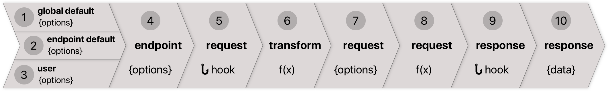

[back to `@octokit/rest`](.)

# How it works



<!-- ①②③④⑤⑥⑦⑧⑨⑩ -->

1. [Endpoint options ① - ④](#endpoint-options)
2. [Transform endpoint to request options ⑥ - ⑦](#transform)
3. [Sending a request & receiving a response ⑧ & ⑩](#request)
4. [Hooks ⑤ & ⑨](#request)

<a name="endpoint-options"></a>
## Endpoint options (① - ④)

`@octokit/rest` exposes a method for each [REST API endpoint](https://developer.github.com/v3/), for example `github.repos.getForOrg()` for [`GET /orgs/:org/repos`](https://developer.github.com/v3/repos/#list-organization-repositories). The methods are generated from the [lib/routes.json](lib/routes.json) file which defines the **② endpoint default options** `method`, `url` and in some cases `headers`.

**② endpoint default options** are merged with **① global defaults**, which are based on [lib/endpoint/defaults.js](lib/endpoint/defaults.js) and the options that were passed into the `require('@octokit/rest')(options)` client setup.

Both are merged with **③ user options** passed into the method. Altogether they result in **④ endpoint options**.

**Example**: get all public repositories of the the [@octokit GitHub organization](https://github.com/octokit).

```js
github.repos.getForOrg({org: 'octokit', type: 'public'})
```

**④ endpoint options** will be

<table>
  <thead>
    <tr>
      <th>Option</th>
      <th>Value</th>
      <th>Source</th>
    </tr>
  </thead>
  <tr>
    <td><strong>baseUrl</strong></td>
    <td><code>'https://api.github.com'</code></td>
    <td>① endpoint defaults</td>
  </tr>
  <tr>
    <td><strong>user-agent</strong> <em>(header)</em></td>
    <td><code>'octokit/rest.js v1.0.0'</code></td>
    <td>① global defaults</td>
  </tr>
  <tr>
    <td><strong>accept</strong> <em>(header)</em></td>
    <td><code>'application/vnd.github.v3+json'</code></td>
    <td>① global defaults</td>
  </tr>
  <tr>
    <td><strong>method</strong></td>
    <td><code>'GET'</code></td>
    <td>② endpoint defaults</td>
  </tr>
  <tr>
    <td><strong>url</strong></td>
    <td><code>'/orgs/:org/repos'</code></td>
    <td>② endpoint defaults</td>
  </tr>
  <tr>
    <td><strong>org</strong> <em>(URL variable)</em></td>
    <td><code>'octokit'</code></td>
    <td>③ user options</td>
  </tr>
  <tr>
    <td><strong>type</strong> <em>(endpoint parameter)</em></td>
    <td><code>'public'</code></td>
    <td>③ user options</td>
  </tr>
</table>

<a name="transform"></a>
## Transform endpoint to request options (⑥ - ⑦)

**④ Endpoint options** are **⑥ transformed** into **⑦ request options**. Most of the transform is happening in [lib/endpoint/index.js](lib/endpoint/index.js).

For example, the endpoint options shown above would result in

<table>
  <tr>
    <th align=left>method</th>
    <td><code>'GET'</code></td>
  </tr>
  <tr>
    <th align=left>url</th>
    <td> <code>'https://api.github.com/orgs/octokit/repos?type=public'</code></td>
  </tr>
  <tr>
    <th align=left>headers[user-agent]</th>
    <td> <code>'octokit/rest.js v1.0.0'</code></td>
  </tr>
  </tr>
  <tr>
    <th align=left>headers[accept]</th>
    <td> <code>'application/vnd.github.v3+json'</code></td>
  </tr>
</table>

<a name="request"></a>
## Sending a request & receiving a response ⑧ & ⑩

Using **⑦ request options** a **⑧ request** is sent to the GitHub REST API. The **⑩ response** is returned to the user.

Most of the request/response is happening in [lib/request/request.js](lib/request/request.js). It is currently using Node’s native [http](https://nodejs.org/api/http.html) & [https](https://nodejs.org/api/https.html) modules, but we will probably use a fetch polyfill in future for better browser compatibility & smaller bundle size.

<a name="hooks"></a>
## Hooks ⑤ & ⑨

Hooks are used internally to inject functionality like authentication. For example, the internal [authentication plugin](lib/plugins/authentication) is registering a request hook in [lib/plugins/authentication/index.js](lib/plugins/authentication/index.js). The method sets the `authorization` header based on authentication previously set using `github.authenticate()` before the **⑧ request**.

Hooks will be used in future for request pagination, throttling and handling of rate limits.

Hooks can be registered using `github.hook.{before|after}`:

```js
github.hook.before('request', (options) => {})
github.hook.after('request', (response, options) => {})
```

The callbacks can return a Promise for asynchronous execution. `options` can be changed in the `github.hook.before` callback before they are transformed **⑥ transformed**. The **⑩ response** can be changed in the `github.hook.after` callback before it is returned to the user.

⚠️ The API is currently experimental and can change at any time.
