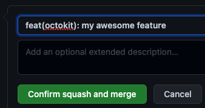

# Maintenance releases

## Merging the Pull Request & releasing a new version

Releases are automated using [semantic-release](https://github.com/semantic-release/semantic-release).
The following commit message conventions determine which version is released:

1. `fix: ...` or `fix(scope name): ...` prefix in subject: bumps fix version, e.g. `1.2.3` → `1.2.4`
2. `feat: ...` or `feat(scope name): ...` prefix in subject: bumps feature version, e.g. `1.2.3` → `1.3.0`
3. `BREAKING CHANGE:` in body: bumps breaking version, e.g. `1.2.3` → `2.0.0`

Only one version number is bumped at a time, the highest version change trumps the others.
Besides, publishing a new version to npm, semantic-release also creates a git tag and release
on GitHub, generates changelogs from the commit messages and puts them into the release notes.

Before the publish it runs the `npm run build` script which creates a `pkg/` folder with distributions for browsers, node and Typescript definitions. The contents of the `pkg/` folder are published to the npm registry.

If the pull request looks good but does not follow the commit conventions, use the <kbd>Squash & merge</kbd> button.

> ⚠️ making sure the message is semantic-release compliant before clicking <kbd>Confirm squash and merge</kbd>:

]

## Breaking changes

When merging a breaking change using the PR body as specified above, extra care must be taken. Breaking changes must first be merged into the `beta` branch, where further testing may be conducted and additional breaking changes may be combined before cutting a release. Note the repository for the change: if it's dependent on other repos where the same change must be made, merge the leaf nodes first before the nodes higher up the tree. Your merge order should look something like:

1. endpoint
1. request
1. plugins
1. auth strategies
1. core
1. *-methods
1. oauth-app
1. webhooks
1. app
1. octokit/octokit.js
1. octokit/rest.js


## Maintenance releases

### 0. Requirements

`semantic-release` is configured in the `package.json` of each repository. If `release.branches` is set, make sure that it includes the line for maintenance releases, for example

```js
  "release": {
    "branches": [
      "+([0-9]).x",
      "main",
      "beta"
    ],
```

`semantic-release` is run in the`.github/workflows/release.yml` GitHub Action workflow. Make sure it's triggered on push in the `*.x` release branches.

```yml
name: Release
"on":
  push:
    branches:
      - main
      - next
      - beta
      - "*.x"
```

### 1. Create a branch for the maintenance version

Find the latest version that was released on the maintenance version. For example, if the current version is 3.1, and you want to release maintenance versions for 2.x, then find the latest 2.x version. Say that's 2.10.9. In that example, create a branch based on this tag

```
git checkout -b 2.x v2.10.9
```

Then push the new `2.x` branch to GitHub

```
git push -u origin HEAD
```

### 2. Create a pull request with the changes for the new maintenance release

Checkout a branch based on the latest maintenance branch, for example

```
git checkout -b 2.x-my-fix 2.x
```

Commit your changes, then push the branch to GitHub and create a pull request with the maintenance branch as base.

### 3. Merge the pull request with the correct commit message

Note that maintenance versions only support `fix: ...` and `feat: ...` commits, no breaking versions can be released from a maintenance release.

The `.github/workflows/release.yml` action should pick up the commit and release the correct version to both GitHub and npm. The npm release will use a `@release-*.x` tag so that the new release is not picked up as `@latest`.

## Troubleshooting

<details>
  <summary>What can I do if I <i>squashed and merged</i> with a commit message which is not <a href="https://github.com/semantic-release/semantic-release">semantic-release</a> compliant?</summary>

1. After merging, do a follow up on `https://github.com/octokit/<repository name>/actions/workflows/release.yml` to assure your commit is not triggering any release. You can find an example of a commit squashed and merged with a non semantic-release commit message [here](https://github.com/octokit/plugin-throttling.js/runs/5390685684?check_suite_focus=true)
2. Mention (`@username`) the maintainers of the project in your merged _Pull Request_ to let them know there was an issue with your merged _Pull Request_. We need to make sure no _Pull Request_ is merged until this issue is addressed.
3. Open a new _Pull Request_ with an [empty commit](https://git-scm.com/docs/git-commit#Documentation/git-commit.txt---allow-empty). In the description, link to the previous merged _Pull Request_ to give context to the reviewers and request a Review from the maintainers. This time make sure the message is [semantic-release](https://github.com/semantic-release/semantic-release) compliant.

</details>
